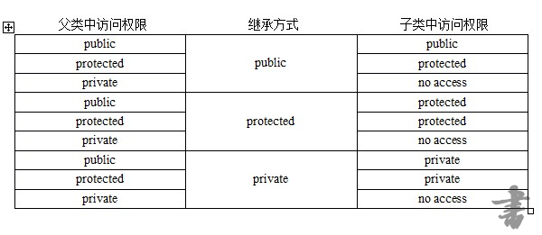
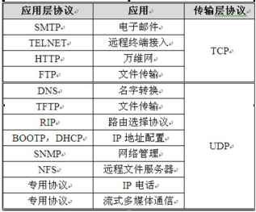
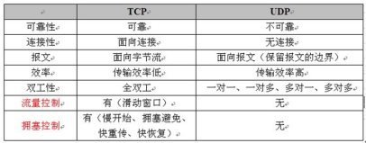

# 百度测试开发面经 整理
## C++
### 继承、封装与多态：
  **继承**：
	  学过面向对象语言的人基本都可以理解什么是继承，但我们为什么要使用继承？
      很多人说继承可以使代码得到良好的复用，当然这个是继承的一个优点，但代码复用的方法除了继承还有很多，而且有些比继承更好。我认为使用继承最重要的原因是继承可以使整个程序设计更符合人们的逻辑，从而方便的设计出想要表达的意思。比如我们要设计一堆苹果，橘子，梨等水果类，使用面向对象的方法，我们首先会抽象出一个水果的基类，而后继承这个基类，派生出具体的水果类。如果要设计的水果很多，我们还可以在水果基类基础上，继续生成新的基类，比如热带水果类，温带水果类，寒带水果类等，而后再继承这些基类。这样的设计思想就相当于人类的分类思想，简单易懂，而且设计出来的程序层次分明，容易掌握。
      既然继承这么好，那该如何使用继承？
      继承虽好但不能滥用，否则设计出来的程序会杂乱不堪。根据上面的介绍，可以发现继承主要用来定义一个东西是什么，比如热带水果是水果，菠萝是热带水果等，即继承主要用来设计一个程序的类的框架，将所要设计的东西用继承来设立一个基本结构。如果想为一个类添加一个行为或格外的功能，最好是使用组合的方式。如果想了解组合的方式，可以看一下比较著名的策略模式。
	  定义：继承就是新类从已有类那里得到已有的特性。 类的派生指的是从已有类产生新类的过程。原有的类成为基类或父类，产生的新类称为派生类或子类，
子类继承基类后，可以创建子类对象来调用基类函数，变量等
　　　　　　　　单一继承：继承一个父类，这种继承称为单一继承，一般情况尽量使用单一继承，使用多重继承容易造成混乱易出问题
　　　　　　　　多重继承：继承多个父类，类与类之间要用逗号隔开，类名之前要有继承权限，假使两个或两个基类都有某变量或函数，在子类中调用时需要加类名限定符如c.a::i = 1；
　　　　　　　　菱形继承：多重继承掺杂隔代继承1-n-1模式，此时需要用到虚继承，例如 B，C虚拟继承于A，D再多重继承B，C，否则会出错
　　　　　　　　继承权限：继承方式规定了如何访问继承的基类的成员。继承方式指定了派生类成员以及类外对象对于从基类继承来的成员的访问权限
　　　　　　　　继承权限：子类继承基类除构造和析构函数以外的所有成员
　　　　继承可以扩展已存在的代码，目的也是为了代码重用
　　　　继承也分为接口继承和实现继承：
　　　　　　普通成员函数的接口总是会被继承：　　子类继承一份接口和一份强制实现
　　　　　　普通虚函数被子类重写　　　　　：　　子类继承一份接口和一份缺省实现
　　　　　　纯虚函数只能被子类继承接口　　：　　子类继承一份接口，没有继承实现
　　　　访问权限图如下：
		
　　　　为了便于理解，伪代码如下，注意这个例子编译是不过的，仅是为了可以更简洁的说明继承权限的作用： 
　　　　class Animal    //父类
　　　　{
　　　　public:
      　　　　void eat(){
          　　　　  cout<<"animal eat"<<endl;
　　　　      }
　　　　protected:
    　　　　  void sleep(){　　　　
     　　　　       cout<<"animal sleep"<<endl;
　　　　      }
　　　　private:
  　　　　    void breathe(){
    　　　　        cout<<"animal breathe"<<endl;
 　　　　     }
　　　　};
　　　　class Fish:public Animal    //子类
　　　　{
　　　　public:
    　　　　  void test() {
     　　　　       eat();       //此时eat()的访问权限为public，在类内部能够访问
      　　　　      sleep();     //此时sleep()的访问权限为protected，在类内部能够访问
     　　　　       breathe();   //此时breathe()的访问权限为no access，在类内部不能够访问
　　　　      }
　　　　};
　　　　int main(void) {
  　　　　    Fish f;
  　　　　    f.eat();          //此时eat()的访问权限为public，在类外部能够访问
  　　　　    f.sleep();        //此时sleep()的访问权限为protected，在类外部不能够访问
  　　　　    f.breathe()       //此时breathe()的访问权限为no access，在类外部不能够访问
　　　　}　　　
     **封装**：
　　　　定义：封装就是将抽象得到的数据和行为相结合，形成一个有机的整体，也就是将数据与操作数据的源代码进行有机的结合，形成类，其中数据和函数都是类的成员，目的在于将对象的使用者和设计者分开，
　　　　   以提高软件的可维护性和可修改性
　　　　特性：1. 结合性，即是将属性和方法结合    2. 信息隐蔽性，利用接口机制隐蔽内部实现细节，只留下接口给外界调用    3. 实现代码重用
	**多态**：
　　　　定义：可以简单概括为“一个接口，多种方法”，即用的是同一个接口，但是效果各不相同，多态有两种形式的多态，一种是静态多态，一种是动态多态
　　　　　　　　动态多态：    是指在程序运行时才能确定函数和实现的链接，此时才能确定调用哪个函数，父类指针或者引用能够指向子类对象，调用子类的函数，所以在编译时是无法确定调用哪个函数
　　　　　　　　　　　　　使用时在父类中写一个虚函数，在子类中分别重写，用这个父类指针调用这个虚函数，它实际上会调用各自子类重写的虚函数。
　　　　　　　　　　　　　    运行期多态的设计思想要归结到类继承体系的设计上去。对于有相关功能的对象集合，我们总希望能够抽象出它们共有的功能集合，在基类中将这些功能声明为虚接口（虚函数），
　　　　　　　　　　　　　然后由子类继承基类去重写这些虚接口，以实现子类特有的具体功能。
　　　　　　　　　　　　　    运行期多态的实现依赖于虚函数机制。当某个类声明了虚函数时，编译器将为该类对象安插一个虚函数表指针，并为该类设置一张唯一的虚函数表，虚函数表中存放的是该类虚函数地址。
　　　　　　　　　　　　　运行期间通过虚函数表指针与虚函数表去确定该类虚函数的真正实现。
　　　　　　　　　　　优点： OO设计重要的特性，对客观世界直觉认识； 能够处理同一个继承体系下的异质类集合
　　　　　　　　　　　　　　vector<Animal*>anims; 
　　　　　　　　　　　　　　Animal * anim1 = new Dog; 
　　　　　　　　　　　　　　Animal * anim2 = new Cat; 
　　　　　　　　　　　　　　 //处理异质类集合 
　　　　　　　　　　　　　　anims.push_back(anim1); 
　　　　　　　　　　　　　　anims.push_back(anim2); 
　　　　　　　　　　　缺点：运行期间进行虚函数绑定，提高了程序运行开销；庞大的类继承层次，对接口的修改易影响类继承层次；由于虚函数在运行期才绑定，所以编译器无法对虚函数进行优化
	  **虚函数**
　　　　　　　　定义：用virtual关键字修饰的函数，本质：由虚指针和虚表控制，虚指针指向虚表中的某个函数入口地址，就实现了多态，作用：实现了多态，虚函数可以被子类重写，虚函数地址存储在虚表中
　　　　　　　　虚表：虚表中主要是一个类的虚函数的地址表，这张表解决了继承，覆盖的问题，保证其真实反应实际的函数，当我们用父类指针来指向一个子类对象的时候，虚表指明了实际所应调用的函数
　　　　　　　　　　　基类有一个虚表，可以被子类继承，(当类中有虚函数时该类才会有虚表,该类的对象才有虚指针，子类继承时也会继承基类的虚表)，子类如果重写了基类的某虚函数，那么子类继承于基类的虚表中该虚函数的地址也会相应改变，指向子类
　　　　　　　　　　　自身的该虚函数实现，如果子类有自己的虚函数，那么子类的虚表中就会增加该项，编译器为每个类对象定义了一个虚指针，来定位虚表，所以虽然是父类指针指向子类对象，但因为此时子类
　　　　　　　　　　　重写了该虚函数,该虚函数地址在子类虚表中的地址已经被改变了，所以它实际调用的是子类的重写后的函数，正是由于每个对象调用的虚函数都是通过虚表指针来索引的,也就决定了虚表指针的
　　　　　　　　　　　正确初始化是非常重要的，即是说，在虚表指针没有正确初始化之前，我们是不能调用虚函数的，因为生成一个对象是构造函数的工作，所以设置虚指针也是构造函数的工作，编译器在构造函数
　　　　　　　　　　　的开头部分秘密插入能初始化虚指针的代码， 在构造函数中进行虚表的创建和虚指针的初始化
　　　　　　　　　　　一但虚指针被初始化为指向相应的虚表，对象就“知道”它自己是什么类型，但只有当虚函数被调用时这种自我认知才有用
　　　　　　　　　　　类中若没有虚函数，类对象的大小正好是数据成员的大小，包含有一个或者多个虚函数的类对象。编译器会向里面插入一个虚指针，指向虚表，这些都是编译器为我们做的，我们完全不必关心
　　　　　　　　　　　这些，所有有虚函数的类对象的大小是数据成员的大小加一个虚指针的大小；对于虚继承，若子类也有自己的虚函数，则它本身需要有一个虚指针，指向自己的虚表，另外子类继承基类时，
　　　　　　　　　　　首先要通过加入一个虚指针来指向基类，因此可能会有两个或多个虚指针（多重继承会多个），其他情况一般是一个虚指针，一张虚表
　　　　　　　　　　　每一个带有virtual函数的类都有一个相应的虚表，当对象调用某一virtual函数时，实际被调用的函数取决于该对象的虚指针所指向的那个虚表-编译器在其中寻找适当的函数指针。
　　　　　　　　效率漏洞：我们必须明白，编译器正在插入隐藏代码到我们的构造函数中，这些隐藏代码不仅必须初始化虚指针，而且还必须检查this的值(以免operator new返回零)和调用基类构造函数。放在一起，
　　　　　　　　　　　这些代码可以影响我们认为是一个小内联函数的调用，特别是，构造函数的规模会抵消函数调用代价的减少，如果做大量的内联函数调用，代码长度就会增长，而在速度上没有任何好处，
　　　　　　　　　　　当然，也许不会立即把所有这些小构造函数都变成非内联，因为它们更容易写为内联构造函数，但是，当我们正在调整我们的代码时，请务必去掉这些内联构造函数
　　　　　　　　虚函数使用：将函数声明为虚函数会降低效率，一般函数在编译期其相对地址是确定的，编译器可以直接生成imp/invoke指令，如果是虚函数，那么函数的地址是动态的，譬如取到的地址在eax寄存
　　　　　　　　　　　器里，则在call eax之后的那些已经被预取到流水线的所有指令都将失效， 流水线越长，那么一次分支预测失败的代价越大，建议若不打算让某类成为基类，那么类中最好不要出现虚函数，
　　　　　　　　纯虚函数：含有至少一个纯虚函数的类叫抽象类，因为抽象类含有纯虚函数，所以其虚表是不健全的，在虚表不健全的情况下是不能实例化对象的，子类继承抽象基类后必须重写基类的所有纯虚函数
　　　　　　　　　　　否则子类仍为纯虚函数子类将抽象基类的纯虚函数全部重写后会将虚表完善，此时子类才能实例化对象，纯虚函数只声明不定义，形如 virtual void print() = 0 
　　　　　　　静态多态：是在编译期就把函数链接起来，此时即可确定调用哪个函数或模板，静态多态是由模板和重载实现的，在宏多态中，是通过定义变量，编译时直接把变量替换，实现宏多态
　　　　　　　　　　优点： 带来了泛型编程的概念，使得C++拥有泛型编程与STL这样的武器； 在编译期完成多态，提高运行期效率； 具有很强的适配性和松耦合性，（耦合性指的是两个功能模块之间的依赖关系）
　　　　　　　　　　缺点： 程序可读性降低，代码调试带来困难；无法实现模板的分离编译，当工程很大时，编译时间不可小觑 ；无法处理异质对象集合
 　　　　　　　　调用基类指针创建子类对象，那么基类应该有虚析构函数，因为如果基类没有虚析构函数，那么在删除这个子类对象的时候会调用错误的析构函数而导致删除失败产生不明确行为，
　　　　　　　　　　int main() {
　　　　　　　　　　　　Base *p = new Derive();　　　　//调用基类指针创建子类对象，那么基类应有虚析构函数，不然当删除的时候会调用错误的析构函数而导致删除失败产生不明确行为，
　　　　　　　　　　　　delete p;　　　　　　　　　　　　//删除子类对象时，如果基类有虚析构函数，那么delete时会先调用子类的析构函数，然后再调用基类的析构函数，成功删除
　　　　　　　　　　　　return 0;　　　　　　　　　　　　//如果基类没有虚析构函数，那么就只会调用父类的析构函数，只删除了对象内的父类部分，造成一个局部销毁，可能导致资源泄露
　　　　　　　　　　}　　　　　　　　　　　　　　　　　　//注：只有当此类希望成为 基类时才会打算声明一个虚析构函数，否则不必要给此类声明一个虚函数

### 函数重载、重定义与重写

**函数重载**
C++ 不允许变量重名，但是允许多个函数取相同的名字，只要参数表不同即可，这叫作函数的重载（读“虫载”，不读“众载”，其英文是 overload）。重载就是装载多种东西的意思，即同一个事物能完成不同功能。

函数的重载使得 C++ 程序员对完成类似功能的不同函数可以统一命名，减少了命名所花的心思。例如，可能会需要一个求两个整数的最大值的函数，也可能还要写一个求三个实数的最大值的函数，这两个函数的功能都是求最大值，那么就都命名为 Max 即可，不需要一个命名为 MaxOfTwoIntegers，另一个命名为 MaxOfThreeFloats。

在调用同名函数时，编译器怎么知道到底调用的是哪个函数呢？编译器是根据函数调用语句中实参的个数和类型来判断应该调用哪个函数的。因为重载函数的参数表不同，而调用函数的语句给出的实参必须和参数表中的形参个数和类型都匹配，因此编译器才能够判断出到底应该调用哪个函数。

**重定义（隐藏）**
在基类和派生类中有同名成员，成员可以是变量，也可以是函数，如果是函数，不管参数或是返回值是否相同，那么子类成员都将屏蔽对父类成员的访问。总之，只要在子类和父类中，只要函数名相同，就可构成函数重定义。

**重写**
在基类和子类中，如果父类是虚函数（函数前有关键字virtual），而子类中有一个完全相同的函数，即可构成重写。完全相同指的是函数名、参数、返回相同，但是对于协变（下文补充），返回值不同，也可构成重写。
函数特征相同。但是具体实现不同，主要是在继承关系中出现的 。当我们对别人提供好的类的方法感觉不是太满意时，我们就可以通过继承这个类然后重写其方法改成我们需要的逻辑。

1、最重要的一点，重写是子类与父类之间的。

2、被重写的函数不能是 static 的。

3、函数三要素（函数名、函数参数、函数返回类型）完全一样 

4、如果父类中有virtual关键字，这种父子之间的关系叫做虚函数重写，这也就是C++中的多态机制，和java自动转换不同的是，C++需要我们手动设置。

### 指针数组，数组指针，指针和引用
指针数组：array of pointers，即用于存储指针的数组，也就是数组元素都是指针
数组指针：a pointer to an array，即指向数组的指针
还要注意的是他们用法的区别，下面举例说明。
int* a[4]     指针数组     
                 表示：数组a中的元素都为int型指针    
                 元素表示：*a[i]   *(a[i])是一样的，因为[]优先级高于*
int (*a)[4]   数组指针     
                 表示：指向数组a的指针
                 元素表示：(*a)[i]  

指针变量相对应的内存空间存储的值恰好是某个内存地址。

(1)指针是实体，引用是别名，没有空间。
(2)引用定义时必须初始化，指针不用。
(3)指针可以改，引用不可以。
(4)引用不能为空，指针可以。
(5)Sizeof(引用)计算的是它引用的对象的大小，而sizeof(指针)计算的是指针本身的大小。
(6)不能有NULL引用，引用必须与一块合法的存储单元关联。
(7)给引用赋值修改的是该引用与对象所关联的值，而不是与引用关联的对象。
(8)如果返回的是动态分配的内存或对象，必须使用指针，使用引用会产生内存泄漏。
(9)对引用的操作即是对变量本身的操作。

指针-对于一个类型T，T*就是指向T的指针类型，也即一个T*类型的变量能够保存一个T对象的地址，而类型T是可以加一些限定词的，如const、volatile等等。
引用-引用是一个对象的别名，主要用于函数参数和返回值类型，符号X&表示X类型的引用。

指针和引用的联系与区别 
★ 相同点：
1. 都是地址的概念；
指针指向一块内存，它的内容是所指内存的地址；引用是某块内存的别名。

★ 区别：
1. 指针是一个实体，而引用仅是个别名；
2. 引用使用时无需解引用(*)，指针需要解引用；
3. 引用只能在定义时被初始化一次，之后不可变；指针可变；
4. 引用没有 const，指针有 const；
5. 引用不能为空，指针可以为空；
6. “sizeof 引用”得到的是所指向的变量(对象)的大小，而“sizeof 指针”得到的是指针本身(所指向的变量或对象的地址)的大小；
7. 指针和引用的自增(++)运算意义不一样；
8.从内存分配上看：程序为指针变量分配内存区域，而引用不需要分配内存区域。

int a=0;
int &b=a;
int *p=a;
&b++;相当于a++;b只是a的一个别名，和a一样使用。
p++;后p指向a后面的内存
(*p)++;相当于a++ 

## 数据结构

数据结构：描述数据元素逻辑关系的集合。队列就是一种先进先出的逻辑结构，栈是一种先进后出的逻辑结构，家谱是一种树形的逻辑结构！数组、链表、堆栈和队列是最基本的数据结构。
数据存储结构：描述数据在计算机中存储方式。常见的有两种：顺序存储，非顺序存储。数组就是顺序存储，数据存储的地址是连续的；链表是非顺序存储，数据存储的地址是不连续的。

数组： 组是使用一块连续的内存空间保存数据，保存的数据的个数在分配内存的时候就是确定的。
在数组中访问数组中第 n 个数据的时间花费是 O(1) ，查找一个指定的数据则是 O(N)。当向数组中插入或者删除数据的时候，最好的情况是在数组的末尾进行操作，时间复杂度是O(1) ，但是最坏情况是插入或者删除第一个数据，时间复杂度是 O(N) 。在任意位置插入或者删除数据的时候，后面的数据全部需要移动，移动的数据还是和数据个数有关所以总体的时间复杂度仍然是 O(N) 。

### 树

树(Tree)的基本概念
树是由结点或顶点和边组成的(可能是非线性的)且不存在着任何环的一种数据结构。没有结点的树称为空(null或empty)树。一棵非空的树包括一个根结点，还(很可能)有多个附加结点，所有结点构成一个多级分层结构。

二叉树
每个结点至多拥有两棵子树(即二叉树中不存在度大于2的结点)，并且，二叉树的子树有左右之分，其次序不能任意颠倒。
二叉树的性质
1.若二叉树的层次从0开始，则在二叉树的第i层至多有2^i个结点(i>=0)
2.高度为k的二叉树最多有2^(k+1) - 1个结点(k>=-1)(空树的高度为-1)
3.对任何一棵二叉树，如果其叶子结点(度为0)数为m, 度为2的结点数为n, 则m = n + 1

二叉树的遍历方法
中序遍历：即左-根-右遍历，对于给定的二叉树根，寻找其左子树；对于其左子树的根，再去寻找其左子树；递归遍历，直到寻找最左边的节点i，其必然为叶子，然后遍历i的父节点，再遍历i的兄弟节点。随着递归的逐渐出栈，最终完成遍历
先序遍历：即根-左-右遍历
后序遍历：即左-右-根遍历

https://blog.csdn.net/LLZK_/article/details/52829525
https://blog.csdn.net/qq_39290007/article/details/79515041

### 链表与队列

队列：队列的特点是先入先出 (FIFO) ，可以使用数组和链表来实现。
队列只允许在队尾添加数据，在队头删除数据。但是可以查看队头和队尾的数据。还有一种是双端队列，在两端都可以插入和删除：

链表： 链表是在非连续的内存单元中保存数据，并且通过指针将各个内存单元链接在一起，最右一个节点的指针指向 NULL 。链表不需要提前分配固定大小存储空间，当需要存储数据的时候分配一块内存并将这块内存插入链表中。

在链表中查找第 n 个数据以及查找指定的数据的时间复杂度是 O(N) ，但是插入和删除数据的时间复杂度是 O(1) ，因为只需要调整指针就可以：

### 如何判断单链表有环

方法一、穷举遍历
方法一：首先从头节点开始，依次遍历单链表的每一个节点。每遍历到一个新节点，就从头节点重新遍历新节点之前的所有节点，用新节点ID和此节点之前所有节点ID依次作比较。如果发现新节点之前的所有节点当中存在相同节点ID，则说明该节点被遍历过两次，链表有环；如果之前的所有节点当中不存在相同的节点，就继续遍历下一个新节点，继续重复刚才的操作。
例如这样的链表：A->B->C->D->B->C->D， 当遍历到节点D的时候，我们需要比较的是之前的节点A、B、C，不存在相同节点。这时候要遍历的下一个新节点是B，B之前的节点A、B、C、D中恰好也存在B，因此B出现了两次，判断出链表有环。
假设从链表头节点到入环点的距离是D，链表的环长是S。那么算法的时间复杂度是0+1+2+3+…+(D+S-1) = (D+S-1)*(D+S)/2 ， 可以简单地理解成 O(N*N)。而此算法没有创建额外存储空间，空间复杂度可以简单地理解成为O(1)。
方法二、哈希表缓存
首先创建一个以节点ID为键的HashSet集合，用来存储曾经遍历过的节点。然后同样是从头节点开始，依次遍历单链表的每一个节点。每遍历到一个新节点，就用新节点和HashSet集合当中存储的节点作比较，如果发现HashSet当中存在相同节点ID，则说明链表有环，如果HashSet当中不存在相同的节点ID，就把这个新节点ID存入HashSet，之后进入下一节点，继续重复刚才的操作。
这个方法在流程上和方法一类似，本质的区别是使用了HashSet作为额外的缓存。
假设从链表头节点到入环点的距离是D，链表的环长是S。而每一次HashSet查找元素的时间复杂度是O(1), 所以总体的时间复杂度是1*(D+S)=D+S，可以简单理解为O(N)。而算法的空间复杂度还是D+S-1，可以简单地理解成O(N)。
方法三、快慢指针
首先创建两个指针1和2（在java里就是两个对象引用），同时指向这个链表的头节点。然后开始一个大循环，在循环体中，让指针1每次向下移动一个节点，让指针2每次向下移动两个节点，然后比较两个指针指向的节点是否相同。如果相同，则判断出链表有环，如果不同，则继续下一次循环。
例如链表A->B->C->D->B->C->D，两个指针最初都指向节点A，进入第一轮循环，指针1移动到了节点B，指针2移动到了C。第二轮循环，指针1移动到了节点C，指针2移动到了节点B。第三轮循环，指针1移动到了节点D，指针2移动到了节点D，此时两指针指向同一节点，判断出链表有环。
此方法也可以用一个更生动的例子来形容：在一个环形跑道上，两个运动员在同一地点起跑，一个运动员速度快，一个运动员速度慢。当两人跑了一段时间，速度快的运动员必然会从速度慢的运动员身后再次追上并超过，原因很简单，因为跑道是环形的。
评论中有 @长沙小辣椒 同学指出：还可以用 set 遍历链表，把节点放入set里，每次访问下个节点时，如果set长度不变，则跳出，说明有环。否则set长度+1，继续遍历。
该方法时间复杂度是O（N），空间复杂度上因为需要额外等数量的存储空间，所以空间复杂度是O（n）。

计算链表环大小
设A的步长是1，B的步长是2。假设AB相遇A走了X步，那么B就走了2X步。假设是第一次相遇，则B多走的路就是环的大小。即X。

求入口点
然后指针1走x，后指针2以同样的速度走，相遇的时候就是
再让另一个指针开始走，这样两个指针距离始终隔一个环长，相遇的时候，就是环入口点

### 堆和栈

栈：是一种连续存储的数据结构，特点是存储的数据先进后出（FILO）。可以使用数组和链表来实现。
堆：是一棵完全二叉树结构，特点是父节点的值大于（小于）两个子节点的值（分别称为最大堆和最小堆）。它常用于管理算法执行过程中的信息，应用场景包括堆排序，优先队列等。

### 哈希表

时间复杂度为O(1) 

哈希表是唯一的专用于集合的数据结构。可以以常量的平均时间实现插入、删除和查找。
哈希表的思想是：用一个与集合规模差不多大的数组来存储这个集合，将数据元素的关键字映射到数组的下标，这个映射称为“散列函数”，数组称为“散列表”。查找时，根据被查找的关键字找到存储数据元素的地址，从而获取数据元素。

index地址与KEY值对应的映射关系叫散列函数

## 算法

### 几种排序原理

#### 交换类：冒泡
算法思想： 
从数组中第一个数开始，依次遍历数组中的每一个数，通过相邻比较交换，每一轮循环下来找出剩余未排序数的中的最大数并”冒泡”至数列的顶端。
算法步骤： 
（1）从数组中第一个数开始，依次与下一个数比较并次交换比自己小的数，直到最后一个数。如果发生交换，则继续下面的步骤，如果未发生交换，则数组有序，排序结束，此时时间复杂度为O(n)； 
（2）每一轮”冒泡”结束后，最大的数将出现在乱序数列的最后一位。重复步骤（1）。
稳定性：稳定排序。
时间复杂度： O(n)至O(n2)，平均时间复杂度为O(n2)。
最好的情况：如果待排序数据序列为正序，则一趟冒泡就可完成排序，排序码的比较次数为n-1次，且没有移动，时间复杂度为O(n)。
最坏的情况：如果待排序数据序列为逆序，则冒泡排序需要n-1次趟起泡，每趟进行n-i次排序码的比较和移动，即比较和移动次数均达到最大值： 
比较次数:Cmax=∑i=1n−1(n−i)=n(n−1)/2=O(n2) 
移动次数等于比较次数，因此最坏时间复杂度为O(n2)。

#### 交换类：快排
冒泡排序是在相邻的两个记录进行比较和交换，每次交换只能上移或下移一个位置，导致总的比较与移动次数较多。快速排序又称分区交换排序，是对冒泡排序的改进，快速排序采用的思想是分治思想。。
算法原理： 
(1)从待排序的n个记录中任意选取一个记录（通常选取第一个记录）为分区标准;
(2)把所有小于该排序列的记录移动到左边，把所有大于该排序码的记录移动到右边，中间放所选记录，称之为第一趟排序；
(3)然后对前后两个子序列分别重复上述过程，直到所有记录都排好序。
稳定性：不稳定排序。
时间复杂度： O（nlog2n）至O(n2)，平均时间复杂度为O（nlgn）。
最好的情况：是每趟排序结束后，每次划分使两个子文件的长度大致相等，时间复杂度为O（nlog2n）。
最坏的情况：是待排序记录已经排好序，第一趟经过n-1次比较后第一个记录保持位置不变，并得到一个n-1个元素的子记录；第二趟经过n-2次比较，将第二个记录定位在原来的位置上，并得到一个包括n-2个记录的子文件，依次类推，这样总的比较次数是： 
Cmax=∑i=1n−1(n−i)=n(n−1)/2=O(n2)

#### 插入类：直接插入
插入排序的基本方法是：每步将一个待排序的记录，按其排序码大小，插到前面已经排序的文件中的适当位置，直到全部插入完为止。
原理：从待排序的n个记录中的第二个记录开始，依次与前面的记录比较并寻找插入的位置，每次外循环结束后，将当前的数插入到合适的位置。
稳定性：稳定排序。
时间复杂度： O(n)至O（n2），平均时间复杂度是O（n2）。
最好情况：当待排序记录已经有序，这时需要比较的次数是Cmin=n−1=O(n)。
最坏情况：如果待排序记录为逆序，则最多的比较次数为Cmax=∑i=1n−1(i)=n(n−1)2=O(n2)。

#### 插入类：shell排序
Shell 排序又称缩小增量排序, 由D. L. Shell在1959年提出，是对直接插入排序的改进。
原理： Shell排序法是对相邻指定距离(称为增量)的元素进行比较，并不断把增量缩小至1，完成排序。
Shell排序开始时增量较大，分组较多，每组的记录数目较少，故在各组内采用直接插入排序较快，后来增量di逐渐缩小，分组数减少，各组的记录数增多，但由于已经按di−1分组排序，文件叫接近于有序状态，所以新的一趟排序过程较快。因此Shell排序在效率上比直接插入排序有较大的改进。
在直接插入排序的基础上，将直接插入排序中的1全部改变成增量d即可，因为Shell排序最后一轮的增量d就为1。
稳定性：不稳定排序。
时间复杂度：O(n1.3)到O(n2)。Shell排序算法的时间复杂度分析比较复杂，实际所需的时间取决于各次排序时增量的个数和增量的取值。研究证明，若增量的取值比较合理，Shell排序算法的时间复杂度约为O(n1.3)。
对于增量的选择，Shell 最初建议增量选择为n/2，并且对增量取半直到 1；D. Knuth教授建议di+1=⌊di−13⌋序列。

#### 选择类：简单选择
选择类排序的基本方法是：每步从待排序记录中选出排序码最小的记录，顺序放在已排序的记录序列的后面，知道全部排完。
原理：从所有记录中选出最小的一个数据元素与第一个位置的记录交换；然后在剩下的记录当中再找最小的与第二个位置的记录交换，循环到只剩下最后一个数据元素为止。
稳定性：不稳定排序。
时间复杂度： 最坏、最好和平均复杂度均为O(n2)，因此，简单选择排序也是常见排序算法中性能最差的排序算法。简单选择排序的比较次数与文件的初始状态没有关系，在第i趟排序中选出最小排序码的记录，需要做n-i次比较，因此总的比较次数是：∑i=1n−1(n−i)=n(n−1)/2=O(n2)。

#### 选择类：堆排序
保存其他中间比较结果
直接选择排序中，第一次选择经过了n-1次比较，只是从排序码序列中选出了一个最小的排序码，而没有保存其他中间比较结果。所以后一趟排序时又要重复许多比较操作，降低了效率。J. Willioms和Floyd在1964年提出了堆排序方法，避免这一缺点。
堆的性质： 
（1）性质：完全二叉树或者是近似完全二叉树； 
（2）分类：大顶堆：父节点不小于子节点键值，小顶堆：父节点不大于子节点键值；图展示一个最小堆： 
（3）左右孩子：没有大小的顺序。
（4）堆的存储 
一般都用数组来存储堆，i结点的父结点下标就为(i–1)/2。它的左右子结点下标分别为 2∗i+1 和 2∗i+2。如第0个结点左右子结点下标分别为1和2。 
（5）堆的操作 
建立： 
以最小堆为例，如果以数组存储元素时，一个数组具有对应的树表示形式，但树并不满足堆的条件，需要重新排列元素，可以建立“堆化”的树。
 
插入： 
将一个新元素插入到表尾，即数组末尾时，如果新构成的二叉树不满足堆的性质，需要重新排列元素，下图演示了插入15时，堆的调整。
删除： 
堆排序中，删除一个元素总是发生在堆顶，因为堆顶的元素是最小的（小顶堆中）。表中最后一个元素用来填补空缺位置，结果树被更新以满足堆条件。
 
稳定性：不稳定排序。

## 操作系统

### 线程与进程
根本区别：进程是操作系统资源分配的基本单位，而线程是任务调度和执行的基本单位在开销方面：每个进程都有独立的代码和数据空间（程序上下文），程序之间的切换会有较大的开销；线程可以看做轻量级的进程，同一类线程共享代码和数据空间，每个线程都有自己独立的运行栈和程序计数器（PC），线程之间切换的开销小。所处环境：在操作系统中能同时运行多个进程（程序）；而在同一个进程（程序）中有多个线程同时执行（通过CPU调度，在每个时间片中只有一个线程执行）内存分配方面：系统在运行的时候会为每个进程分配不同的内存空间；而对线程而言，除了CPU外，系统不会为线程分配内存（线程所使用的资源来自其所属进程的资源），线程组之间只能共享资源。包含关系：没有线程的进程可以看做是单线程的，如果一个进程内有多个线程，则执行过程不是一条线的，而是多条线（线程）共同完成的；线程是进程的一部分，所以线程也被称为轻权进程或者轻量级进程。

### 内存的分配方式
内存分配方式有三种：
（1） 从静态存储区域分配。内存在程序编译的时候就已经分配好，这块内存在程序的整个运行期间都存在。 例如全局变量static变量。
（2） 在栈上创建。在执行函数时，函数内局部变量的存储单元都可以在栈上创建，函数执行结束时这些存储 单元自动被释放。栈内存 分配运算内置于处理器的指令集中，效率很高，但是分配的内存容量有限。
（3） 从堆上分配，亦称动态内存分配。程序在运行的时候用malloc或new申请任意多少的内存，程序员自己负责在何时用free或delete释放内存。动态内存的生存期由我们决定，使用非常灵活，但问题也最多。

### 进程之间的通信（IPC）

一、管道
管道，通常指无名管道，是 UNIX 系统IPC最古老的形式。
1、特点：
它是半双工的（即数据只能在一个方向上流动），具有固定的读端和写端。
它只能用于具有亲缘关系的进程之间的通信（也是父子进程或者兄弟进程之间）。
它可以看成是一种特殊的文件，对于它的读写也可以使用普通的read、write 等函数。但是它不是普通的文件，并不属于其他任何文件系统，并且只存在于内存中。

二、FIFO
FIFO，也称为命名管道，它是一种文件类型。
1、特点
FIFO可以在无关的进程之间交换数据，与无名管道不同。
FIFO有路径名与之相关联，它以一种特殊设备文件形式存在于文件系统中。

三、消息队列
消息队列，是消息的链接表，存放在内核中。一个消息队列由一个标识符（即队列ID）来标识。
1、特点
消息队列是面向记录的，其中的消息具有特定的格式以及特定的优先级。
消息队列独立于发送与接收进程。进程终止时，消息队列及其内容并不会被删除。
消息队列可以实现消息的随机查询,消息不一定要以先进先出的次序读取,也可以按消息的类型读取。

四、信号量
信号量（semaphore）与已经介绍过的 IPC 结构不同，它是一个计数器。信号量用于实现进程间的互斥与同步，而不是用于存储进程间通信数据。
1、特点
信号量用于进程间同步，若要在进程间传递数据需要结合共享内存。
信号量基于操作系统的 PV 操作，程序对信号量的操作都是原子操作。
每次对信号量的 PV 操作不仅限于对信号量值加 1 或减 1，而且可以加减任意正整数。
支持信号量组。

五、共享内存
共享内存（Shared Memory），指两个或多个进程共享一个给定的存储区。
1、特点
共享内存是最快的一种 IPC，因为进程是直接对内存进行存取。
因为多个进程可以同时操作，所以需要进行同步。
信号量+共享内存通常结合在一起使用，信号量用来同步对共享内存的访问。

### 多线程的实现方式

java 不会

1、继承Thread类创建线程
2、实现Runnable接口创建线程
3、实现Callable接口通过FutureTask包装器来创建Thread线程
4、使用ExecutorService、Callable、Future实现有返回结果的线程

## 计算机网络

### TCP三次握手四次挥手

Tcp三次握手： 
1、第一次握手，客户端发送syn=j到服务器 
2、服务器返回syn=k,ack=j+1, 
3、客户端再向服务器发送ack=k+1; 
三次握手结束，客户端和服务器建立连接 
TCP四次挥手： 
1、客户端发送fin=j包关闭连接 
2、服务器返回ack=j+1 
3、服务器发送fin=k包关闭连接 
4、客户端返回ack=k+1 
四次挥手结束，连接断开 
为什么连接三次，断开连接四次？ 
在连接中，服务器的ack和syn包是同时发送的，而在断开连接的时候，服务器向客户端发送的ack和fin包是分两次发送的，因为服务器收到客户端发送的fin包时，可能还有数据要传送，所以先发送ack，等数据传输结束后再发送fin断开这边的连接。 

### tcp与udp区别

1、TCP面向连接（如打电话要先拨号建立连接）;UDP是无连接的，即发送数据之前不需要建立连接 
2、TCP提供可靠的服务。也就是说，通过TCP连接传送的数据，无差错，不丢失，不重复，且按序到达;UDP尽最大努力交付，即不保 证可靠交付 
3、TCP面向字节流，实际上是TCP把数据看成一连串无结构的字节流;UDP是面向报文的，应用层交给UDP多长的报文，UDP就照样发送，即一次发送一个报文。UDP没有拥塞控制，因此网络出现拥塞不会使源主机的发送速率降低（对实时应用很有用，如IP电话，实时视频会议等） 
4、每一条TCP连接只能是点到点的;UDP支持一对一，一对多，多对一和多对多的交互通信 
5、TCP首部开销20字节;UDP的首部开销小，只有8个字节 
6、TCP的逻辑通信信道是全双工的可靠信道，UDP则是不可靠信道 

## git指令与理解

## Linux指令

